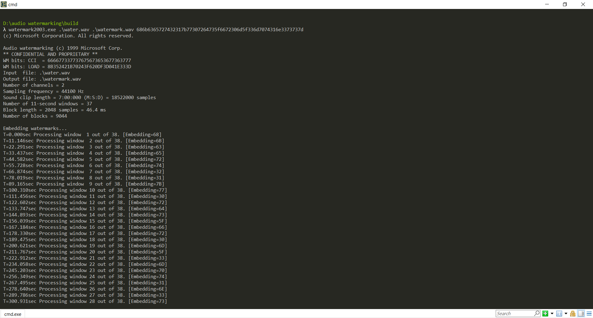
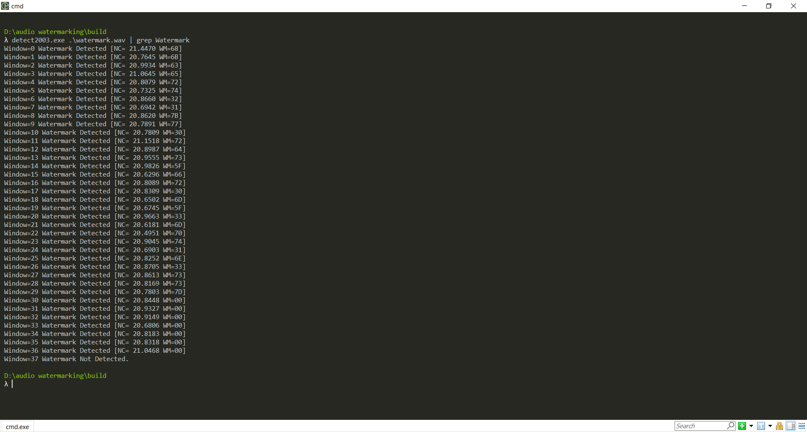
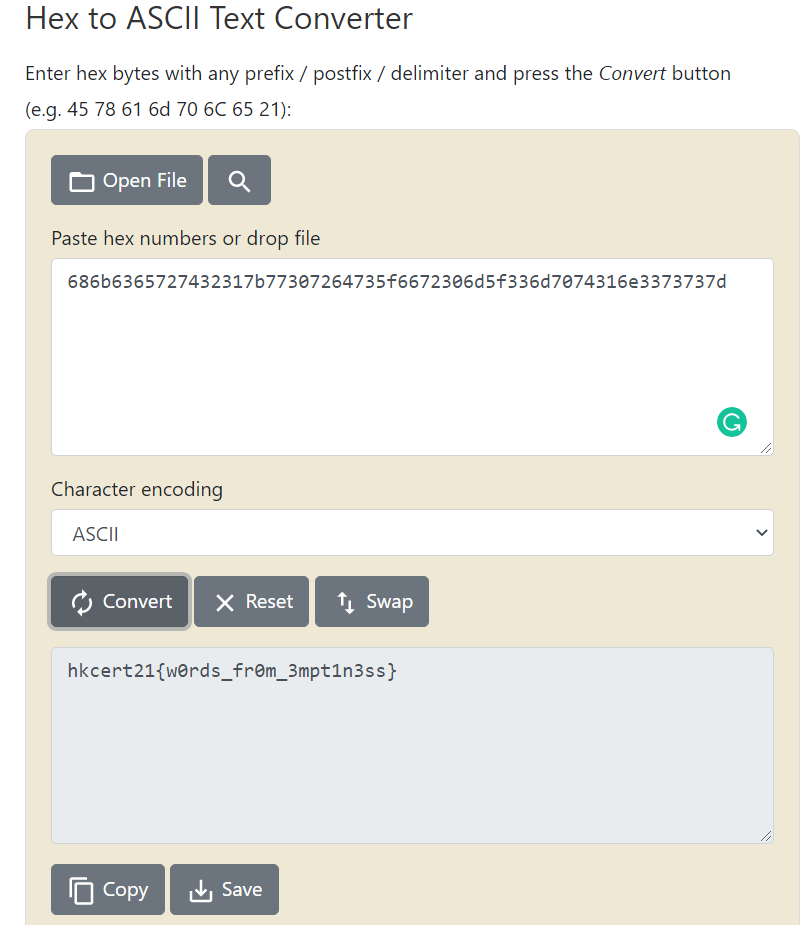

Write-up
===

## Prologue

This is an easy chal on introduction on stegonography. Audio watermark is an techology to add extra information on a track without changing the audio.

## Walkthrough

1. Google the description
2. Find the [GitHub repository](https://github.com/toots/microsoft-audio-watermarking) written by Microsoft 
3. Download the tool (repository) in zip
4. Extract the zip, for example, you extract the zip under `D:\Downloads`
5. Copy the audio file (`waterwave.wav`) to `D:\Download\microsoft-audio-watermarking-master\build\`
6. Open the command prompt and execute the following:
```
D:\Download\microsoft-audio-watermarking-master\build\detect2003.exe D:\Download\microsoft-audio-watermarking-master\build\watermark.wav
```


Here I use `grep` to filter out all Hex.


7. Record all Hex decoded
8. Convert all Hex it into ASCII characters, there are many [online tools](https://www.binaryhexconverter.com/hex-to-ascii-text-converter) that can be used


9. Profit

## Eplogue

Some contestor espically the secondary division have no idea on how to use command line (command prompt), which is an obstical for them to reach other tools without GUI.
