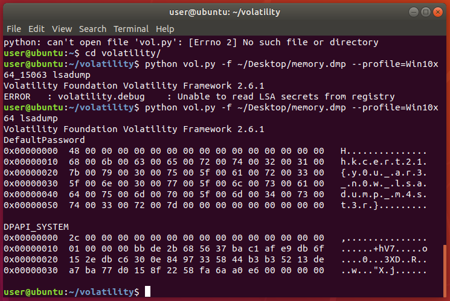

Write-up
===

## Prologue

Basic training of volatility. Windows 10 default password does not have any protection on deault password.

## Walk-through

```bash
python vol.py -f ./memory.dmp --profile=Win10x64 lsadump
```



## Eplogue

As the password is not encrypted, there are unintended solution where contestor can string the memory dump directly.
