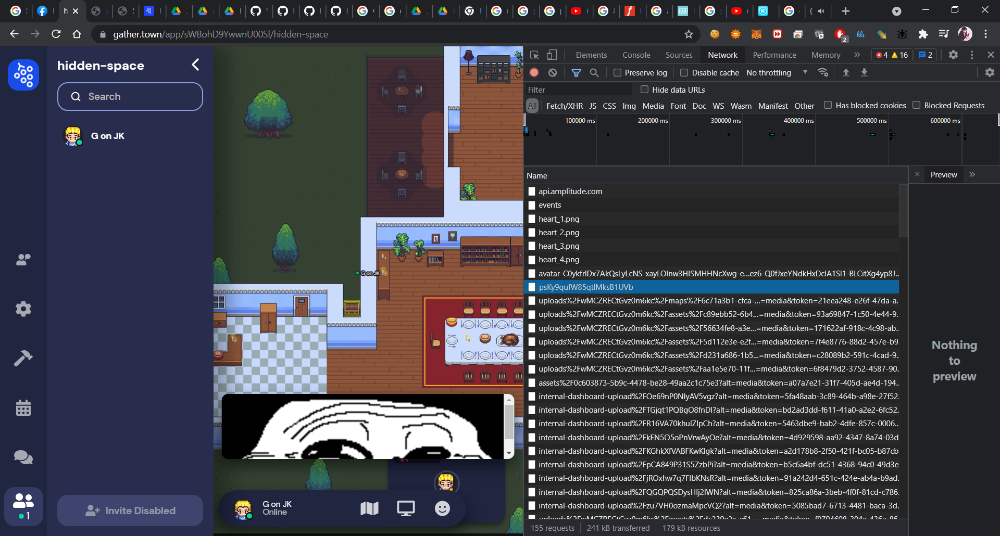
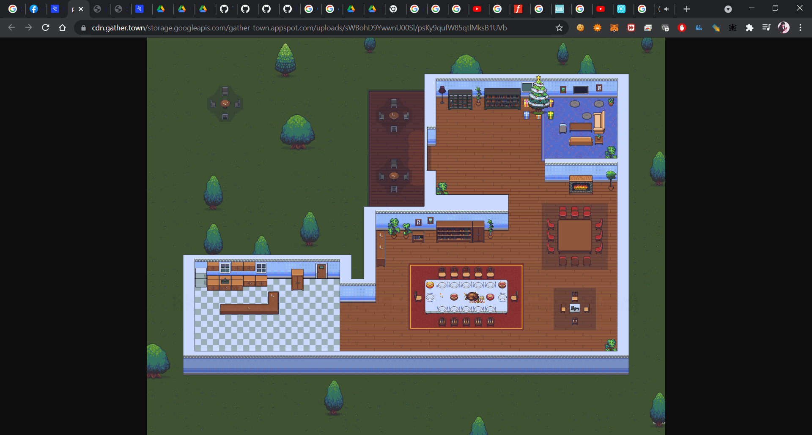
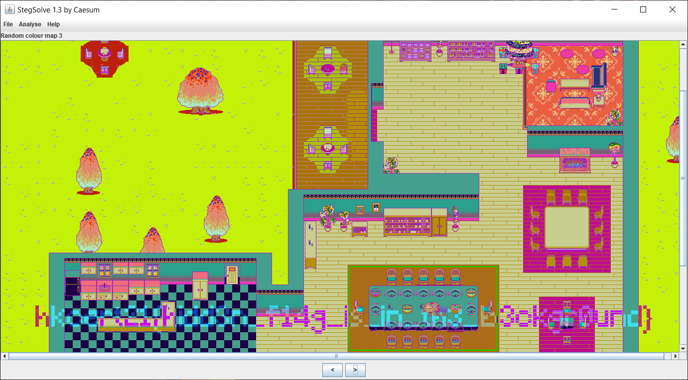

Writeup
===

## Prologue

Simple tuning web challenge on gather.town. Find the flag hidden in the background.

## Walkthrough

Find the background image from network traffic.

Use any `stegsolve` to solve LSB. Photoshop should also be applicable.

## Eplogue

1. The map cloning does not work, so it create some problem when the chal is released.
2. Contestor mixing up the flags.
3. Contestor being trolled or distracted by other item on map (intended).