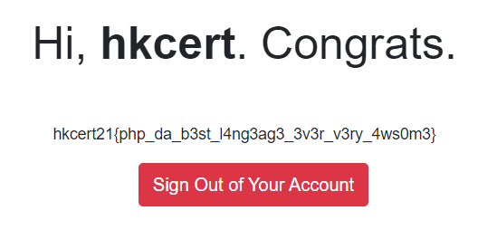

Write-up
===

## Prologue

PHP magic hash should be easy to find and collide. Idea from <https://www.facebook.com/photo?fbid=10216154961946194&set=a.2104140142503>.

## Walkthrough

Login with the following credential. Refer to `collision.py`.
```
hkcert:hkcert8NUYx
```

md5(hkcert8NUYx) = 0e641877790316254295701331084566

list of possible keys:
```console
$ python collision.py
2021-08-20 20:31:49.839995
Current Value of i: 1
Current Value of i: 2
Current Value of i: 3
Current Value of i: 4
Current Value of i: 5
2021-08-20 20:37:29.301314
hkcert8NUYx: 0e641877790316254295701331084566
2021-08-20 20:55:01.196259
hkcertDwOzB: 0e937863866804668856129745881929
2021-08-20 20:57:23.172729
hkcertHHRHV: 0e743659244857001554537958398966
Current Value of i: 6
2021-08-20 21:09:46.905805
hkcert03cuzq: 0e156888369542700929404896109728
2021-08-20 21:26:26.485648
hkcert0vmyMs: 0e566983931238026834022086745222
2021-08-20 21:37:39.841918
hkcert0OJ6qA: 0e295803459353918923333291938772
2021-08-20 21:43:05.462948
hkcert0YfSIu: 0e089583517061815377966505832125
2021-08-20 22:02:25.880877
hkcert1vzPjh: 0e256596674415565362950394436202
2021-08-20 22:03:23.229199
```

Once an unique password is used, the flag can be obtained.


## Eplogue

We are intentionally giving out the used password list. However, everyone is using a different hash collision algorithm which make this chal much easier.

I have also used a different PHP version between development (PHP 7.4) and production (PHP 8.0), which casue some contestor failed to get the flag. Luckly, no obvious brute-force attempt was found.

## Reference
<https://github.com/spaze/hashes/blob/master/md5.md>
